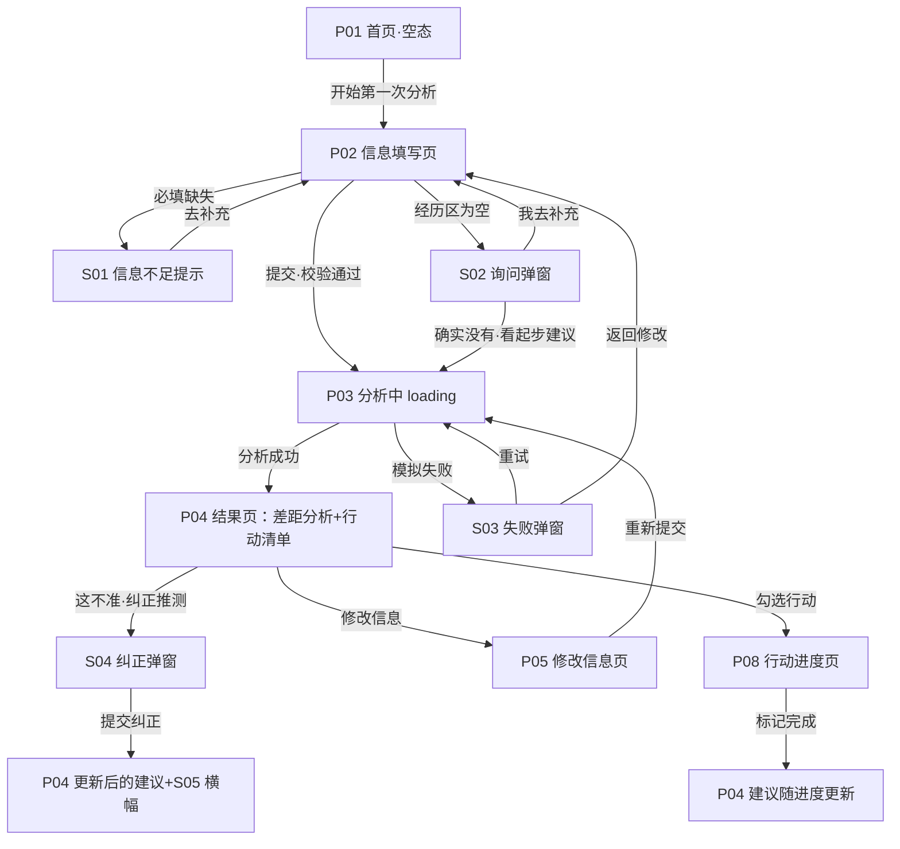
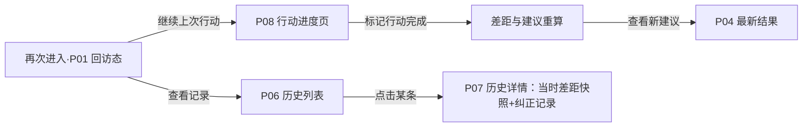

# 实习罗盘 · 产品说明文档

> 面向首次准备实习的大学生的 AI 求职准备助手
> 一句话定位：**看清你与目标岗位的差距，告诉你下一步该做什么。**

| 项 | 内容 |
|---|---|
| 文档版本 | v1.0.1（2026-10-06，勘误：统一行动优先级规则，5.1 与 7.1 数字对齐） |
| 产品形态 | Web 网页应用（纯前端静态原型，无后端、无数据库、无真实 AI 调用） |
| 主演示设备 | 桌面浏览器 1440×900（Chrome/Edge），兼容 375×812 移动端布局 |
| 使用角色 | 单角色：学生用户（演示为预置已登录状态，无登录/注册页） |
| 演示方式 | `docker compose up --build` 后浏览器打开，全部交互本地模拟 |

---

## 1 目标用户、触发场景与竞品替代方案

### 1.1 目标用户

**首次准备实习的在校大学生**，进一步界定：

| 维度 | 界定 | 选择依据 |
|---|---|---|
| 年级 | 大二、大三为主 | 首次找实习的高发阶段；大四多为补录/秋招，不属于"第一次准备" |
| 状态 | 已有（或想有）一个目标岗位方向 | 完全无目标者属于"探索期"，问题不同（见 2.2 暂不做） |
| 经历 | 有课程项目 / 社团 / 比赛 / 自媒体等 0~2 段经历，但不会把它们与岗位要求对应 | 二手资料：校园论坛与求职社区高频话题（见 2.3 分级） |
| 时间 | 距离期望实习开始还有 1~4 个月，每周可投入 5~15 小时 | 决定了"行动清单"必须做时间可行性检查（见 5.2） |

**代表性用户画像（演示用虚构角色）**：
- 张小雨，大三，市场营销专业，目标"产品运营实习生"，有公众号运营经历，不知道自己"够不够格、还差什么"。
- 李明，大二，计算机专业，目标"前端开发实习生"，暂时没有任何项目经历，不知道从哪开始。

### 1.2 触发场景

| # | 场景 | 用户心理 | 产品响应 |
|---|---|---|---|
| T1 | 看到心仪实习 JD，想知道"我配不配得上" | 心虚、不敢投 | 输入目标岗位+经历 → 差距分析 |
| T2 | 决定开始准备，但打开招聘 App 被信息淹没 | 迷茫、无从下手 | 单岗位聚焦的行动清单，按优先级排序 |
| T3 | 准备了一两周，不知道进展、接下来干嘛 | 不确定、容易放弃 | 行动进度回看 + 建议随进度更新 |
| T4 | 再次进入产品，想看上次结论和已完成的事 | 需要连续感 | 历史记录 + 历史详情 + 继续行动 |

### 1.3 核心问题定义（本次选定）

在"不知道优先准备什么"与"不知道经历与岗位的差距"两个候选问题中，**本次选择后者作为主要问题**：

> **已有目标岗位的首次实习准备者，无法把自己的既有经历结构化地对照岗位要求，因此不知道差距在哪、下一步做什么。**

选择依据：① 该问题更聚焦、可在一次产品会话内走完"判断→行动"闭环；② "优先准备什么"本质上是"差距"的下游问题，先解决差距认知；③ 与题目给定的痛点描述直接对应。

### 1.4 竞品与替代方案（实际体验证据，体验日期 2026-10-06）

| 竞品/替代方案 | 实际体验观察（事实） | 未解决的痛点 | 对本方案的影响 |
|---|---|---|---|
| ① 牛客网（nowcoder.com） | 首页以"招聘动态 / 官网投递"信息流为主，含大量 27 届职位精选与公司投递入口，核心链路是"看岗位→投递" | 强投递导向，弱准备导向；没有基于个人经历的差距诊断，首次准备者依然不知道先补什么 | 本方案反其道：**先诊断、后行动**，不做岗位信息流 |
| ② 实习僧（shixiseng.com） | 首页为职位分类列表流（互联网/通信硬件/设计传媒等分类 + 热门职位卡片），核心能力是"发现岗位" | 信息密度高，首次准备者易被淹没；同样没有"你 vs 岗位"的个人化对照 | 本方案做减法：**一次只对准一个目标岗位**，给出结构化差距视图 |
| ③ 通用 AI 助手（豆包 doubao.com） | 通用对话界面，可就"怎么准备实习"给出泛化建议 | 不了解用户具体经历与时间条件；建议是通用清单而非个人差距；对话结束即散，无行动追踪与回看 | 本方案：**结构化输入 → 差距表 + 行动清单 + 进度回看**，可纠正、可沉淀 |

**结论**：三类替代方案分别解决了"信息获取（岗位在哪）"和"通用建议（大致怎么做）"，但没有一个解决"**我现在的经历 vs 我的目标岗位，差在哪、按什么顺序补**"。这就是本产品的切入点。

### 1.5 持续使用的价值（再次进入时看到什么）

首次分析后，用户带着"行动清单"离开；行动完成 → 再次进入 → 在「我的行动」标记完成 → 系统重算差距与建议 → 用户看到匹配度变化与新的下一步；历史记录沉淀每次分析的快照，可对比"我从 59% 走到 74%"。价值闭环 = **差距认知 → 行动 → 反馈 → 新认知**，不设计完整职业生命周期。

---

## 2 范围取舍与需求依据分级

### 2.1 本次保留功能（7 项）

| # | 功能 | 说明 |
|---|---|---|
| F1 | 目标岗位设定 | 从预置岗位库选择（4 个岗位，本地内置 JD 数据） |
| F2 | 个人经历结构化填写 | 年级/专业/经历条目（多类型）/技能自评/每周可投入时间/期望实习时间 |
| F3 | AI 差距分析（模拟） | 维度对比表 + 差距等级 + 匹配度 + 依据标签（事实/推测/待补充） |
| F4 | 行动清单生成 | 按优先级排序的行动项，含预期收益、预计耗时、时间可行性检查 |
| F5 | 用户纠正 AI 推测 | 对推测性结论点"这不准"，填原因与修正，建议即时重算 |
| F6 | 行动进度标记 | 完成/放弃行动后，差距与建议更新 |
| F7 | 历史记录 | 分析快照列表 + 详情回看 + 删除；localStorage 本地保存 |

### 2.2 暂不做功能及理由

| 功能 | 不做的理由 |
|---|---|
| 简历编辑 | 与"差距判断"问题不同层；简历工具市场成熟；编辑器工程量大挤占核心流程（考核约束亦禁止） |
| 岗位采集与投递 | 需要后端数据与合规处理；招聘平台（牛客/实习僧等）已充分覆盖；与"准备阶段"错位（考核约束禁止） |
| 模拟面试 | 属准备中后期诉求，需真实 LLM 或海量语料，先验证"差距认知"问题是否成立（考核约束禁止） |
| 企业招聘 / 入职管理 | B 端功能，与 C 端首次准备问题无关（考核约束禁止） |
| 完全无目标的探索期用户支持 | 无目标者需要的是职业科普/测评，是另一个产品问题；本次入口即要求选择目标岗位 |
| 真实 AI 接口 / 后端 / 数据库 | 考核硬性约束：全部本地静态模拟 AI 输出、loading、报错 |
| 账号系统 | 演示形态用 localStorage 模拟登录态即可，不增加无关页面 |

### 2.3 需求依据分级：事实 / 二手资料 / 未验证假设

| 级别 | 内容 |
|---|---|
| **事实（真实体验观察）** | ① 2026-10-06 实际访问牛客网：首页为招聘动态+官网投递入口的信息流；② 同日实际访问实习僧：首页为分类职位列表流；③ 同日实际访问豆包：通用对话界面。三者的界面结构与核心链路如 1.4 表所述 |
| **二手资料（间接推断，未做定量调研）** | ① "首次准备者不清楚优先准备什么、不知道经历与岗位差距"的痛点描述——来自题干给定背景与校园求职社区高频话题的常识性归纳；② 岗位要求的常见维度（技能/项目/沟通/业务理解）——来自对公开 JD 的常识性归纳 |
| **未验证假设（需后续验证）** | H1：首次准备者最缺"差距认知"而非"更多信息"；H2：结构化差距视图比对话式建议更能促进行动；H3：用户愿意每周回来更新行动进度；H4：把经历与要求逐维对照后，用户投递意愿/准备行动会提升。以上均未用真人访谈或数据验证，验证方案见第 6 节 |

> 注：本文档未将任何 AI 生成的"访谈记录/用户评价/调研数据"作为证据使用；演示角色（张小雨/李明）为虚构，仅用于推演与演示。

---

## 3 页面与状态清单

单角色产品（学生用户）。路由为 hash 形式，原型位置相对项目根目录。

### 3.1 页面清单

| 编号 | 页面名 | 角色 | 进入方式 | 核心操作 | 跳转去向 | 原型位置 |
|---|---|---|---|---|---|---|
| P01 | 首页（空态 / 回访态） | 学生 | 打开应用；无本地记录→空态，有记录→回访态 | 空态：开始第一次分析；回访态：继续上次行动、查看记录、新建分析、重置演示 | →P02 / P06 / P08；重置→S07 | `index.html#/home` |
| P02 | 信息填写页 | 学生 | 首页/历史页点「开始分析」「新建分析」 | 选择目标岗位；填写年级、专业、经历条目（多类型）、技能自评、每周可投入时间、期望实习时间；演示控制开关（模拟失败） | 提交校验通过→P03；必填缺失→S01；经历为空→S02 | `index.html#/form` |
| P03 | 分析中页（loading） | 学生 | P02/P05 提交后 | 展示分阶段进度动画与文案（读取信息→对照岗位→生成建议）；可「取消」 | 成功→P04；失败→S03；取消→返回 P02/P05（已填信息保留） | `index.html#/analyzing` |
| P04 | 结果页（差距分析+行动清单） | 学生 | 分析成功进入 | 查看匹配度、维度差距表（含依据标签）；勾选行动加入「我的行动」；对推测点「这不准」（S04）；点「修改信息」 | 选行动→P08；纠正→本页重算+S05；修改→P05 | `index.html#/result/:id` |
| P05 | 修改信息页 | 学生 | P04 点「修改信息」 | 编辑预填表单（如更换目标岗位、增删经历），重新提交 | →P03→P04（新结果，历史保留旧记录） | `index.html#/form?edit=1` |
| P06 | 历史记录列表 | 学生 | 导航「我的记录」 | 倒序查看历次分析（时间/岗位/匹配度）；删除单条（S06）；新建分析 | →P07 / P02 | `index.html#/history` |
| P07 | 历史详情页 | 学生 | 历史列表点击某条 | 查看该次差距快照、行动清单与纠正记录；「继续这些行动」 | →P08 / P04 | `index.html#/history/:id` |
| P08 | 行动进度页（空态 / 有行动态） | 学生 | 导航「我的行动」；P04/P07 勾选行动 | 标记行动「完成 / 放弃」；查看完成度与整体进度 | 完成后建议更新提示（S05）→查看 P04 | `index.html#/actions` |

### 3.2 弹窗与异常状态清单（全部入清单，原型均有对应画面）

| 编号 | 状态/弹窗名 | 触发条件 | 核心内容与操作 | 结果去向 | 原型位置 |
|---|---|---|---|---|---|
| S01 | 必填信息不足提示 | P02 提交时目标岗位/年级/专业/每周时间为空 | 弹窗提示缺哪些必填项 + 表单行内红字标注；按钮「去补充」自动定位聚焦第一个缺失字段 | 停留 P02 补充后再提交 | `#/form` + 弹窗 |
| S02 | 经历为空询问弹窗 | P02 提交且经历区完全为空 | 「你还没有任何经历吗？」：[我去补充] / [确实还没有，看起步建议] | 补充→停留 P02；起步→P03→P04 起步模式（S08） | `#/form` + 弹窗 |
| S03 | AI 生成失败重试弹窗 | 演示控制开启（表单页开关或 URL `?demo=fail`）时，loading 后模拟失败 | 「分析生成失败（模拟）」+ 模拟原因文案；[重试分析] [返回修改信息]；提示已填信息不会丢失 | 重试→P03（预设第二次成功）；返回→P02/P05 | `#/analyzing` + 弹窗 |
| S04 | 纠正 AI 推测弹窗 | P04 对某条[推测]结论点「这不准」 | 显示被纠正结论；选择原因（信息有误 / 情况已更新 / 不适用）+ 填写修正说明；[提交纠正] [取消] | 提交→P04 重算受影响维度与行动 + S05；取消→停留 | `#/result/:id` + 弹窗 |
| S05 | 建议已更新横幅（toast） | 纠正提交后 / 行动完成后重算 | 「已根据你的纠正更新建议（N 条修正）」或「行动完成，建议已更新」，数秒自动消失 | 停留当前页 | 结果页/行动页顶部 |
| S06 | 删除历史记录确认弹窗 | P06 点某条「删除」 | 「删除这条分析记录？」[取消] [确认删除] | 确认→列表移除（其余记录不受影响） | `#/history` + 弹窗 |
| S07 | 清空演示数据确认弹窗 | 首页右上「重置演示」或 URL `?reset=1` | 「清空全部本地演示数据？」[取消] [确认清空] | 确认→回到 P01 空态（首次打开状态） | 全局 + 弹窗 |
| S08 | 起步模式结果页（信息不足降级态） | S02 选「确实还没有」后分析完成 | 结果页顶部显示「起步模式」标签（信息不足，未计算匹配度）；展示通用起步行动包；提示「补充经历后可获得完整差距分析」 | 补充经历→P05；行动→P08 | `#/result/:id`（mode=starter） |

---

## 4 业务流程图

### 4.1 主流程（首次使用 → 拿到行动清单）



### 4.2 异常与分支流程说明

- **取消分析**：P03 loading 中点「取消」→ 返回填写页，已填信息完整保留，不产生历史记录。
- **信息不足（两级）**：阻断级（必填项缺失，S01）不允许提交；降级级（经历为空但用户确认"还没有"，S02→S08）给起步建议而非拒绝服务，并明确提示数据不足以做完整分析。
- **AI 失败（S03）**：仅由演示开关触发（默认路径永不失败）；失败不清空输入；重试预设第二次成功；持续失败场景可用 URL `?demo=fail-hard` 演示（弹窗始终提供"返回修改信息"出口，用户不会死锁）。
- **修改信息（P05）**：重新分析生成新结果页与新历史记录，旧记录保留，历史详情可回看每次快照。

### 4.3 首次使用 vs 再次使用（衔接价值）



---

## 5 核心功能与 AI 规则说明

### 5.1 核心功能定义：AI 差距分析 + 行动清单

- **用户目标**：知道"我与目标岗位差在哪、按什么顺序补、要花多少时间"。
- **输入**：目标岗位（预置库单选）+ 结构化个人经历（年级、专业、经历条目、技能自评、每周可投入时间、期望实习时间）。
- **输出**：① 匹配度（百分比+档位文案）；② 维度差距表（岗位要求 / 你的情况 / 差距等级 / 依据标签）；③ 行动清单（行动项、优先级、预期收益、预计耗时、时间可行性提示）。
- **页面行为与状态变化**：提交→P03 loading（分阶段文案）→成功→P04；失败→S03；纠正→P04 局部重算+S05；行动完成→P08→建议更新。
- **业务规则（模拟 AI 引擎，本地确定性规则，可复现、无网络请求）**：

```
预置岗位库（4 个岗位，每个含 5 个要求维度，维度权重：高=3 / 中=2 / 低=1）：
  1. 产品运营实习生：内容与新媒体运营(高)、数据分析与工具(高)、
     用户与活动运营(中)、业务理解(中)、沟通与执行力(低)
  2. 产品经理实习生：需求分析与产品思维(高)、项目/实践经历(高)、
     数据意识(中)、沟通协作(中)、工具使用(低)
  3. 前端开发实习生：HTML/CSS/JS 基础(高)、项目实践(高)、
     工程化与协作(中)、计算机基础(中)、学习能力(低)
  4. 数据分析实习生：SQL 与数据处理(高)、统计基础(高)、
     可视化与报表(中)、业务思维(中)、沟通表达(低)

差距等级判定：维度满足度 = 充足(1.0) / 部分满足(0.5) / 缺失(0) / 待补充(不计入)
匹配度 = Σ(维度权重 × 满足度) ÷ Σ(计入维度权重) × 100%
档位文案：≥70% 有竞争力·重点补短板；40%~69% 起步线·差距明确可补；<40% 差距较大·先聚焦基础

行动清单生成：缺失维度→1~2 个补差行动；部分满足→1 个补差行动；充足维度→1 个巩固表达行动
行动优先级跟随维度权重：高权重(3)维度的补差行动为高优先级；中权重(2)为中优先级；
             低权重(1)为低优先级；巩固表达行动（充足/已纠正维度）一律为低优先级
排序规则：优先级降序 → 每周耗时降序
时间可行性：若高优先级行动每周合计耗时 > 每周可投入时间 × 80%，
           行动清单顶部显示「时间偏紧，建议先聚焦前 2 项」提示（不隐藏其余项）
```

### 5.2 AI 何时介入、输入输出

| 环节 | 是否 AI 介入 | 说明 |
|---|---|---|
| 表单校验、导航、历史、删除、重置 | 否 | 纯确定性前端规则 |
| **提交信息后生成差距分析与行动清单** | **是（模拟）** | 输入=表单全部字段；输出=差距表+匹配度+行动清单 |
| **用户纠正推测后重算** | **是（模拟）** | 输入=被纠正结论+原因+修正说明；输出=受影响维度与行动项的更新 |

loading 为模拟延时（分阶段文案约 3 秒），无任何网络请求。演示版 AI 输出全部由上述本地规则引擎预生成/计算，确定性可复现。

### 5.3 依据呈现规则（可信度核心）

结果页每条差距结论必须携带依据标签，三选一：

- **[事实]**：直接来自用户填写内容（如"公众号运营 1 年，粉丝 3000+"）。
- **[推测]**：系统由缺失信息推断（如"未提供 SQL 相关经历，推测缺乏数据工具实操"），推测可被纠正。
- **[待补充]**：判定所需信息缺失，维度标"待补充"不计入匹配度，并提示"补充 X 可提升判断准确度"。

### 5.4 用户如何纠正 AI 推测

1. 入口：P04 差距表中每条[推测]结论右侧「这不准」按钮（[事实]条目不可纠正，只能去 P05 修改原始信息）。
2. 纠正弹窗（S04）：显示原结论 → 选择原因（信息有误 / 情况已更新 / 不适用）→ 填写修正说明（必填）。
3. 重算规则：仅重算被纠正维度及关联行动项；差距等级变化→行动清单相应增删；匹配度重算。
4. 反馈：S05 横幅「已根据你的纠正更新建议（N 条修正）」；纠正记录写入当次历史快照，P07 可回看。
5. 纠正示例：AI 推测张小雨"缺线上活动完整案例"→ 她纠正"曾独立策划 300 人参与的公众号抽奖联动活动"→ 维度"用户与活动运营"部分满足→充足，匹配度 59%→68%，原"策划线上活动"行动移除，新增低优先级"把联动活动写成完整案例复盘"。

### 5.5 AI 失败如何处理

- 触发：仅演示控制（表单页开关或 URL `?demo=fail`）；默认路径永不失败。
- 表现：loading 约 3 秒后弹 S03「分析生成失败（模拟）：本地分析引擎未返回结果」。
- 出口：[重试分析]（预设第二次成功，演示"失败后可继续"）或 [返回修改信息]（输入不丢失）；`?demo=fail-hard` 演示持续失败，弹窗始终保留"返回修改信息"出口，不产生死锁。
- 原则：失败不产生部分结果、不写历史记录、不清空用户输入。

### 5.6 历史记忆规则

- 记录内容：每次成功分析生成一条记录（时间、目标岗位、匹配度、差距快照、行动清单、纠正记录）。
- 存储方式：浏览器 localStorage（演示无后端）。
- 修改与删除：P05 修改信息产生**新记录**（旧记录保留）；P06 可删除单条（S06 确认）；S07 一键清空全部演示数据恢复初始状态。
- 回看：P07 显示当时快照（不随后续修改变化）+ 纠正记录 + 「继续这些行动」入口。

---

## 6 产品验证方案

> 以下均为**目标定义与统计口径**，非实测数据；演示原型不内置真实埋点。

### 6.1 核心成功指标（1 个）

**「选行动率」**：完成首次差距分析的用户中，14 日内在行动清单勾选 ≥1 项行动的用户占比。
- 统计对象：完成首次分析的用户（分母）；
- 口径：分析完成时刻起 14 日内，勾选行动 ≥1 项（分子）；
- 观察周期：以自然周为粒度，滚动观察 4 周。
- 选取理由：直接衡量产品是否完成了"从认知到行动"的核心价值主张。

### 6.2 过程指标（3 个）

| 指标 | 口径 | 观察周期 | 意义 |
|---|---|---|---|
| 信息填写完成率 | 进入 P02 的用户 → 提交成功的比例 | 周 | 表单负担是否过重（门槛问题） |
| 纠正使用率 | 提交分析的用户中使用 ≥1 次「这不准」的比例 | 周 | AI 推测可信度与可纠错性（若纠正率过高说明推测质量差） |
| 7 日回访率 | 首次分析后 7 日内再次打开的比例 | 周 | 行动清单是否真的把用户拉回来（H3 假设的直接检验） |

### 6.3 最小验证方法

1. **可用性走查（n=10）**：招募 10 名首次准备实习的大学生，给定预置目标岗位，观察 30 分钟内能否独立完成"填写→看懂差距→选 1 个行动→纠正 1 条推测"，记录卡点与提问。
2. **前后对比小样本（n=20）**：A 组用本产品差距视图，B 组用通用建议清单，1 周后比较"完成了 ≥1 项行动"的比例（检验 H1/H2）。
3. **数据回流**：正式版接入匿名埋点统计 6.1/6.2 指标；演示版以模拟数据说明口径。

### 6.4 误导建议与操作失败的发现机制

- 纠正内容分类：把「这不准」的修正说明按维度归类，高频被纠正的维度 = 规则引擎误判重灾区，迭代 JD 库与判定规则。
- 抽样校验：每周抽样 20 条分析结果，人工对照岗位库检查差距判定与行动建议的一致性。
- 失败监控：统计 S03 出现次数与重试成功率（正式版）；演示版通过走查脚本 ③ 验证失败路径可走通。
- 兜底原则：所有[推测]结论可被一键纠正；[待补充]永不计入匹配度，避免"看起来很准其实没依据"。

---

## 7 两套模拟案例

> 以下角色与数据均为**虚构模拟内容**，用于演示与走查，原型中已预置。

### 7.1 案例 A：正常成功案例（张小雨 · 产品运营实习生）

**输入**：
- 大三 / 市场营销专业 / 目标岗位：产品运营实习生 / 每周可投入 10 小时 / 期望 3 个月内开始实习
- 经历：① 校园公众号运营 1 年（粉丝 3000+，周更 2 篇）；② 全国大学生市场调查与分析大赛省赛二等奖；③ 院学生会宣传部干事半年
- 技能自评：微信排版工具（熟练）、Excel（熟悉）、SQL（未填）

**模拟 AI 输出**（按 5.1 规则计算）：

| 维度（权重） | 岗位要求 | 你的情况 | 差距等级 | 依据 |
|---|---|---|---|---|
| 内容与新媒体运营（高） | 具备内容策划与账号运营经验 | 公众号运营 1 年，粉丝 3000+，周更 2 篇 | 充足 | [事实] |
| 数据分析与工具（高） | 会用 Excel/SQL 做基础数据分析 | Excel 熟悉；未提供 SQL 相关经历 | 部分满足 | [事实]+[推测]（推测缺 SQL 实操） |
| 用户与活动运营（中） | 有用户增长或线上活动实践 | 社团宣传经历；未见完整线上活动案例 | 部分满足 | [事实]+[推测] |
| 业务理解（中） | 了解目标行业产品与业务模式 | 未见相关体现 | 缺失 | [推测] |
| 沟通与执行力（低） | 跨部门沟通与推进能力 | 学生会+比赛可体现 | 充足 | [推测] |

- 匹配度 = (3×1.0 + 3×0.5 + 2×0.5 + 2×0 + 1×1.0) ÷ 11 × 100% ≈ **59%**，档位文案「起步线：差距明确可补」。
- 行动清单（时间检查：高优先级每周 4h ≤ 10h×80%，排期成立）：

| # | 行动项 | 优先级 | 预期收益 | 预计耗时 |
|---|---|---|---|---|
| 1 | 完成 SQL 基础课程，并用公众号后台数据做 1 次小分析练习 | 高 | 补齐数据分析维度 | 每周 4h × 3 周 |
| 2 | 策划 1 次小型线上活动并写复盘 | 中 | 活动运营案例 | 每周 3h × 2 周 |
| 3 | 研究 3 个目标公司产品，输出 1 页业务理解笔记 | 中 | 补齐业务认知 | 每周 2h × 2 周 |
| 4 | 把公众号经历量化改写成 3 条成果句（阅读增长/涨粉/互动率） | 低 | 面试表达素材 | 2h |
| 5 | 整理比赛/学生会经历的可迁移能力清单 | 低 | 巩固表达 | 1.5h |

**纠正演示**（T4 衔接）：张小雨对"未见完整线上活动案例"点「这不准」→ 原因选"信息有误" → 修正说明"曾独立策划 300 人参与的公众号抽奖联动活动" → 维度更新为充足，匹配度 59%→**68%**，「策划线上活动」行动移除、新增低优先级"把联动活动写成完整案例复盘"，S05 横幅提示 1 条修正。一周后她完成行动 1 → 回到 P08 标记完成 → 数据分析维度升级，建议更新。

### 7.2 案例 B：异常案例

**B1 信息不足（李明 · 前端开发实习生）**
- 输入：大二 / 计算机专业 / 目标岗位：前端开发实习生 / 每周 8 小时 / **经历区完全为空**。
- 流程：提交 → S02 弹窗「你还没有任何经历吗？」→ 选「确实还没有，看起步建议」→ P03 → **S08 起步模式结果页**（顶部「起步模式」标签；不显示匹配度，提示"补充经历后可获得完整差距分析"）。
- 起步行动包：

| # | 行动项 | 优先级 | 预计耗时 |
|---|---|---|---|
| 1 | 系统学习 HTML/CSS/JS 基础（跟完一套入门课程） | 高 | 每周 5h × 4 周 |
| 2 | 跟教程做出第一个个人主页并部署 | 高 | 每周 3h × 2 周 |
| 3 | 注册 GitHub，学会提交与管理代码 | 中 | 2h |
| 4 | 收集 5 条前端实习 JD，建立目标感 | 低 | 1h |

（时间检查：高优先级每周 8h = 8h×100% > 80% → 显示「时间偏紧，建议先聚焦前 2 项」提示。）

**B2 AI 生成失败（张小雨数据重放）**
- 进入方式：P02 底部「演示控制（评审用）」勾选「模拟下一次分析失败」，或直接访问 `index.html#/form?demo=fail`。
- 流程：提交 → P03 loading 约 3 秒 → **S03 弹窗**「分析生成失败（模拟）：本地分析引擎未返回结果」→ 点[重试分析] → loading → 成功 → P04 正常结果（与 7.1 一致）。
- 备选路径：弹窗点[返回修改信息] → 回 P02，全部输入保留；`?demo=fail-hard` 可演示持续失败（出口始终存在，不死锁）。

---

## 8 演示说明（概要）

| 项 | 说明 |
|---|---|
| 启动方式 | `docker compose up --build` → 浏览器打开 `http://localhost:8080`（详见 README.md） |
| 主演示设备 | 桌面 Chrome/Edge，1440×900；兼容 375×812 |
| 预置内容 | 岗位库 4 岗位；预置案例数据（张小雨/李明，可一键载入，标注"模拟"） |
| 进入关键状态 | 空态=首次打开或重置后；loading=任意提交；S01=必填留空提交；S02/S08=经历为空提交；S03=演示开关或 `?demo=fail`；纠正=P04 点「这不准」；修改后更新=P05 改目标岗位重新提交；历史=导航「我的记录」 |
| 恢复初始状态 | 首页右上「重置演示」（S07 确认弹窗）或 URL 加 `?reset=1` |

> 演示全程无网络请求、无真实 AI 调用；所有"AI 输出"由本地规则引擎生成，所有角色与数据均为虚构模拟，界面在结果页与起步模式页固定展示「模拟数据」标识。

## 9 走查脚本（设计阶段预定义，实际结果于原型完成后在自检清单回填）

| # | 脚本 | 步骤概要 | 预期结果 |
|---|---|---|---|
| ① 主流程 | 空态首页 → 载入张小雨案例 → 提交 → loading → 结果页 → 勾选行动 1 | 匹配度 59%，差距表 5 维度带依据标签，行动清单 5 项，行动页出现行动 1 |
| ② 修改/纠正流程 | 结果页点「这不准」纠正活动案例 → 提交；再点「修改信息」把目标岗位改为数据分析实习生 → 重新提交 | 纠正后 68%+行动清单变化+S05；改岗位后差距表与行动清单整体切换为数据分析版本，历史新增一条记录 |
| ③ 失败/信息不足流程 | 必填留空提交（S01）→ 补齐但经历清空提交（S02→S08 起步模式）；开启模拟失败提交（S03）→ 重试成功 | S01 定位缺失字段；S08 显示起步模式不显示匹配度；S03 失败弹窗可重试成功，输入全程不丢失 |

---

*本文档为 110-LAB 产品岗考核交付物之一；配套交付：可交互原型（index.html 等）、Docker 部署（Dockerfile/docker-compose.yml/README.md）、mcp-config.json。文档规则、原型交互、模拟案例三者版本对应 v1.0。*
